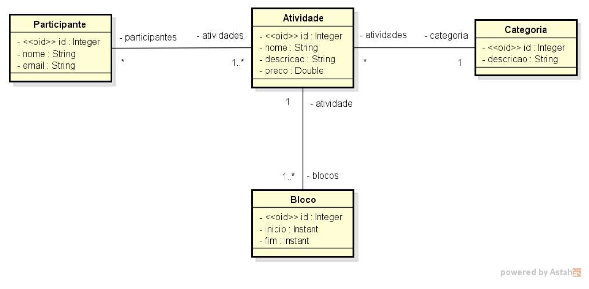
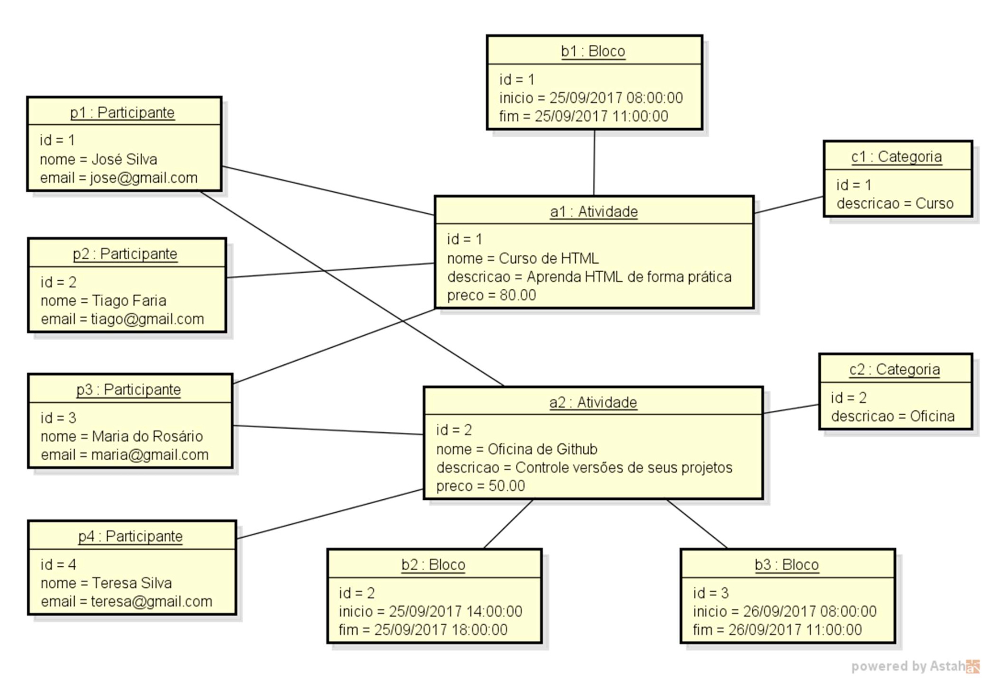

# Desafio: Modelo de domínio e ORM

## Visão Geral

Este desafio envolve a criação de um modelo de domínio e sua implementação usando JPA (Java Persistence API) com Spring
Boot. O objetivo é modelar os relacionamentos entre entidades e persistí-las em um banco de dados relacional.

## Requisitos

- Java
- Spring Boot (Spring Web, Spring Data JPA)
- Banco de Dados SQL (H2)

## Modelo de Domínio

### Entidades

1. **Atividade**
    - `id`: Integer
    - `nome`: String
    - `descricao`: String
    - `preco`: Double
    - `categoria`: Categoria (Many-to-One)
    - `blocos`: List\<Bloco\> (One-to-Many)
    - `participantes`: List\<Participante\> (Many-to-Many)

2. **Bloco**
    - `id`: Integer
    - `inicio`: Instant
    - `fim`: Instant
    - `atividade`: Atividade (Many-to-One)

3. **Participante**
    - `id`: Integer
    - `nome`: String
    - `email`: String (unique)
    - `atividades`: List\<Atividade\> (Many-to-Many)

4. **Categoria**
    - `id`: Integer
    - `nome`: String

## Relacionamentos

- **Atividade** para **Bloco**: One-to-Many
- **Bloco** para **Atividade**: Many-to-One
- **Atividade** para **Participante**: Many-to-Many
- **Participante** para **Atividade**: Many-to-Many
- **Atividade** para **Categoria**: Many-to-One

## Configuração

1. **Clone o repositório:**
   ```sh
   git clone https://github.com/dluks-learning/ds-jsp02
   cd ds-jsp02
   ```

2. **Construa o projeto:**
   ```sh
   ./mvnw clean install
   ```

3. **Execute a aplicação:**
   ```sh
   ./mvnw spring-boot:run
   ```

## Uso

- A aplicação será iniciada e conectada ao banco de dados SQL configurado.
- Para visualizar as tabelas, acesse o console H2 em `http://localhost:8080/h2-console` e use as credenciais
  configuradas no `application.properties`.

## Diagramas

### Diagrama de Classes



### Diagrama de Banco de Dados



###

## Licença

Este projeto é licenciado sob a [Licença MIT](LICENSE)